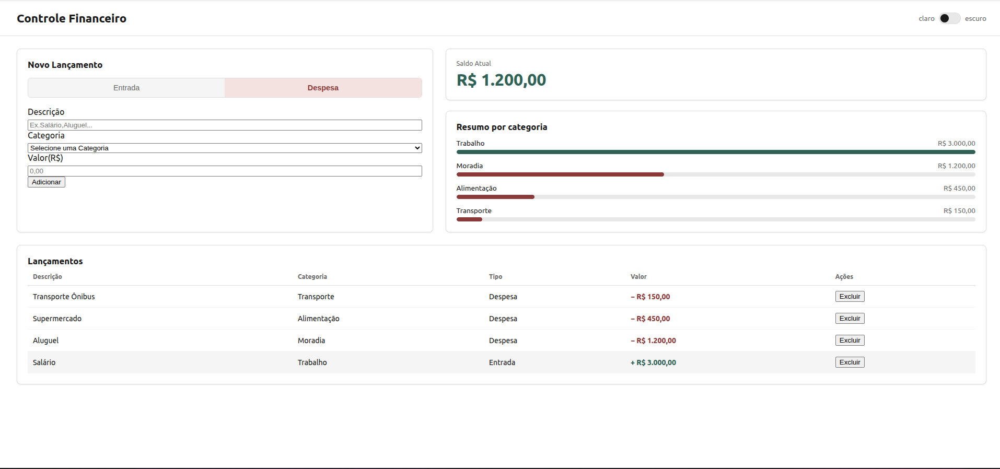
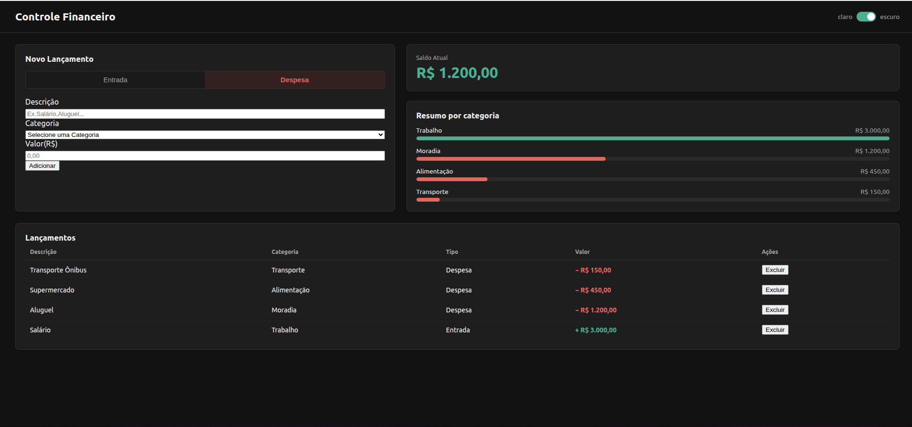

# 💰 Controle Financeiro

Um sistema simples de controle financeiro desenvolvido para organizar entradas e despesas de forma prática e visual.

Este projeto foi desenvolvido como parte do meu aprendizado em **Análise e Desenvolvimento de Sistemas**, utilizando HTML, CSS e JavaScript.

---

## 📌 Sobre o projeto

O Controle Financeiro permite registrar movimentações financeiras e acompanhar o saldo de forma simples.

A ideia do projeto é centralizar informações financeiras em uma interface limpa e fácil de utilizar, evitando a necessidade de planilhas complexas.

---

## ✨ Funcionalidades

- [x] Cadastro de entradas
- [x] Cadastro de despesas
- [x] Seleção de categorias
- [x] Cálculo do saldo atual
- [x] Lista de lançamentos
- [x] Resumo por categoria
- [x] Exclusão de lançamentos
- [x] Modo claro e escuro
- [x] Interface responsiva

---

## 🛠️ Tecnologias utilizadas

- HTML5
- CSS3
- JavaScript

---

## 🎨 Interface

O projeto possui uma interface simples e minimalista, com diferentes indicadores visuais para facilitar a identificação de entradas e despesas.

### ☀️ Modo claro



### 🌙 Modo escuro


---

## 📂 Estrutura do projeto

```text
controle-financeiro/
│
├── index.html
├── style.css
├── script.js
├── README.md
│
└── images/
    ├── cfmodoclaro.png
    └── cfmodoescuro.png


    ## 🚀 Como executar

1. Baixe ou clone este repositório.

2. Abra a pasta do projeto no VS Code.

3. Abra o arquivo `index.html`.

4. Execute utilizando a extensão **Live Server** no VS Code ou abra o arquivo diretamente no navegador.

---

## 📚 O que aprendi com este projeto

Durante o desenvolvimento deste projeto, pratiquei:

- Estruturação de páginas com HTML5;
- Organização de estilos utilizando CSS;
- Utilização de classes e IDs;
- Variáveis CSS;
- Criação de temas claro e escuro;
- Manipulação do DOM com JavaScript;
- Eventos e formulários;
- Organização de código;
- Responsividade;
- Versionamento utilizando Git e GitHub.

🎯 Objetivo

Este projeto foi criado com o objetivo de colocar em prática os conhecimentos adquiridos em HTML, CSS e JavaScript, desenvolvendo uma aplicação funcional desde sua estrutura até sua interface e interações.

Além disso, o projeto faz parte da construção do meu portfólio como estudante de Análise e Desenvolvimento de Sistemas.

👩🏻‍💻 Desenvolvido por

Keshiner

Estudante de Análise e Desenvolvimento de Sistemas.

Este projeto faz parte da minha jornada de aprendizado e desenvolvimento do meu portfólio.